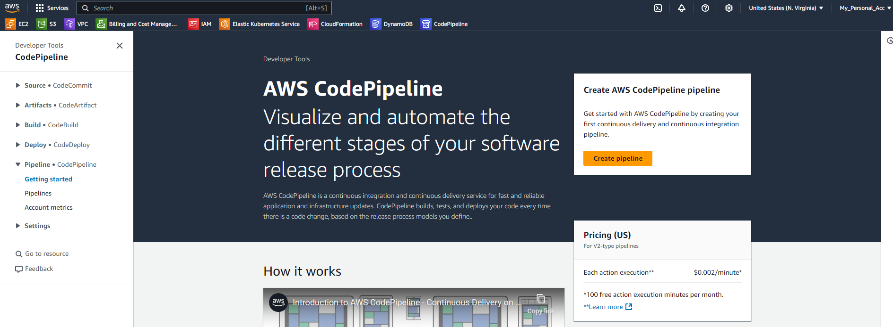
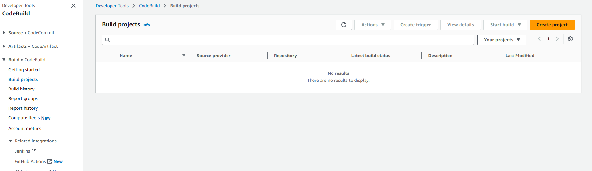
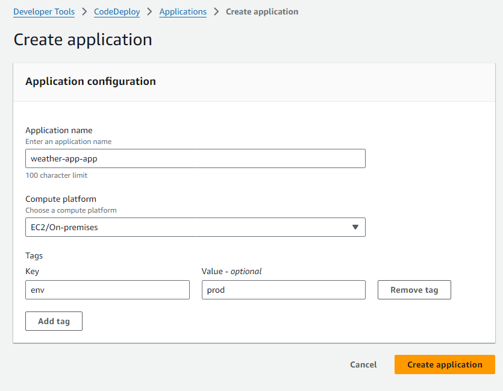
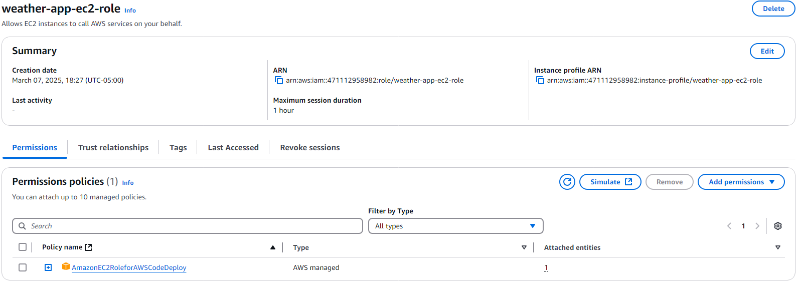
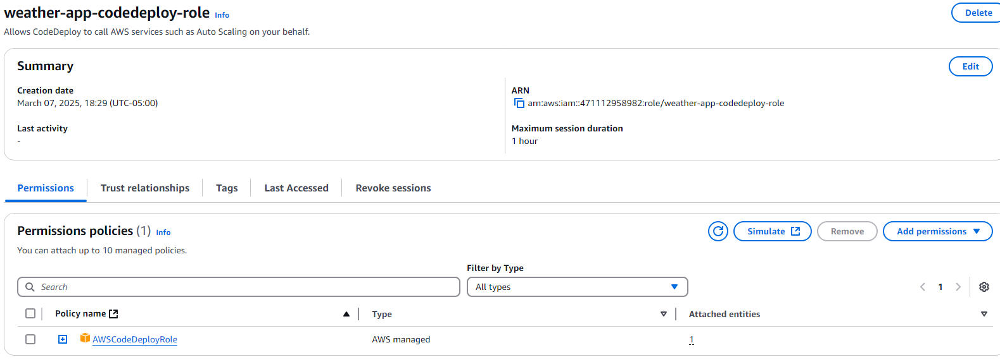
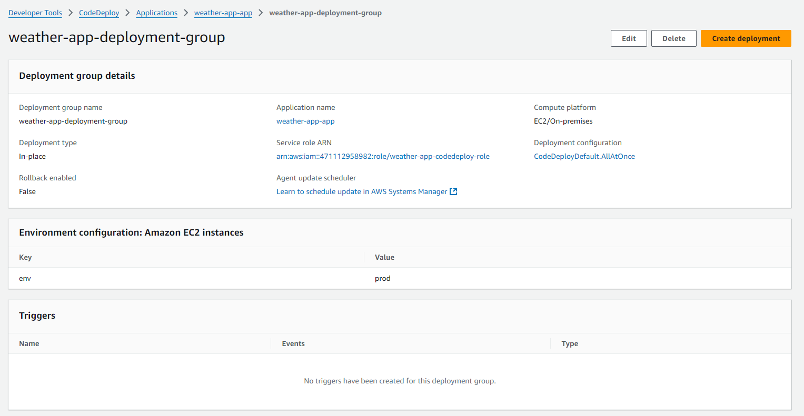
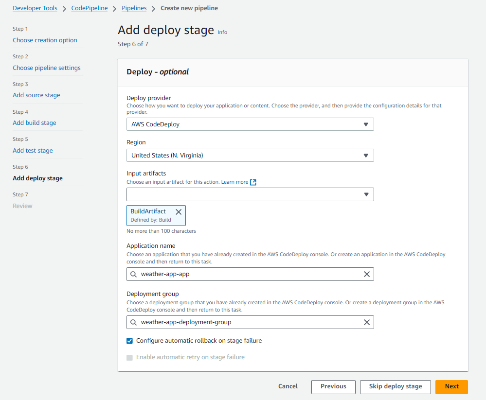
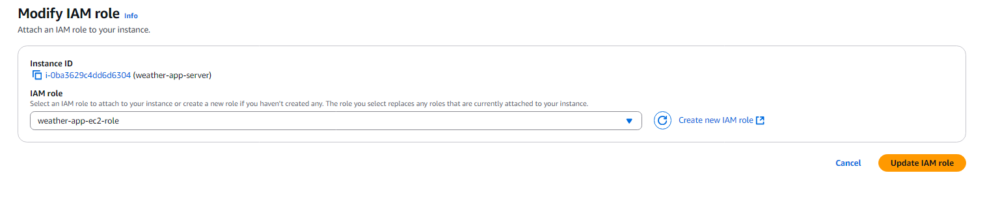
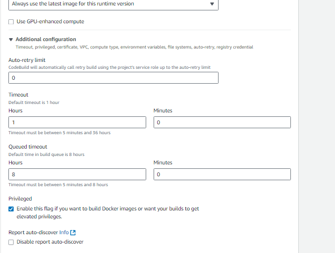
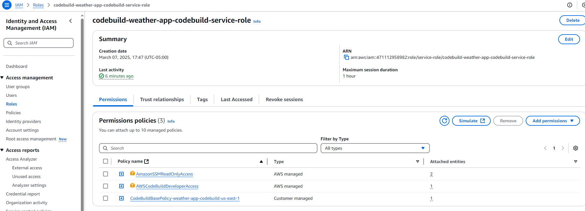

# Building a CICD Pipeline for my weather app from scratch

This is my entire process for building a complete CICD pipeline from scratch using AWS CodePipeline. I will be using other services like CodeBuild and CodeDeploy too. I am using an application called Weather App that I made for this purpose. You can fork the repo if you want to implement the same.

# Secrets set-up

We first need to add sensitive data such as our docker username and password as we will be using it in the pipeline. We can do this via AWS Systems Manager. Open 
Systems Manager and select Parameter Store. Click 'Create parameter' and add name to your secret. Keep your name same as given in the image and if not change your name in the buildspec.yml file since it will be used for reference. 

Keep the tier as standard, Type as SecureString, Data type as text and in Value add your Username. Once done click on create parameter and do it for password and registry url. Since we are using docker hub as our registry, set the value for registry as 'docker.io'. It should look like this.

# Pipeline Setup

First, log into your AWS account and open AWS CodePipeline Service. 

Click on create pipeline and select 'Build custome pipeline' and click next.

Give name to your pipeline and service role when you scroll down, and then click next.

Here, as my app is hosted on Github, I would be selecting my source as Github(via Guthub App). Click 'Connect your Github' and a new window will pop-up. Do the required and once done, find the repo and add it. Set the default branch as 'main'. Keep the rest as it is. And click next.

Before, we go to the build stage, we first need to build the project for CodeBuild. In a new tab, open 'CodeBuild' and create new project.

Add name to your project, select the source as Github, connect to it if not, select 'Repository in my Github Account' and search your repo. 

In the Environment section, keep the defaults and select Operating system as 'Ubuntu'. Next in the Buildspec section, select 'Use a buildspec file' since it is in the repo.

Make no changes to the rest and click create project.

Now, go the IAM and then to Roles. Select the role that was created by the CodeBuild. Click on it and in the 'Permissions' tab, click 'add permissions'. Select Attach Policies and search for '' and attach it to the role.

Once created, head back to the CodePipeline and select next. You should be in the Build Stage. Now select 'Other build providers' and add 'AWS CodeBuild'.

Add the project that you created in the CodeBuild and keep the rest as default. We dont have a test stage to skip that and go to Deploy.

We also need to create a CodeDeploy deployment before adding it to pipeline so in a new tab, open CodeDeploy and click on Create Application. Add name and select "EC2/On-premises" in Compute platform. Click on add tag and add `Key as env` and `Value as prod`. Click 'Create Application'

We need 2 roles for CodeDeploy since the CodeDeploy will be using EC2 instance to deploy our application and EC2 would be using a CodeDeploy agent to run the deployment. So again head over to IAM and go to roles.

1st role would for EC2 so keep the trusted entity as EC2 and in the 'Add permission', search for 'AmazonEC2RoleforAWSCodeDeploy', add that and create role.

2nd role would for CodeDeploy so keep the trusted entity as CodeDeploy and in the 'Add permission', keep the default and create role.

Once created, go back to Deployment group and click on 'Create deployment group'. Enter the name of your deployment group, select the role that we created earlier in Service Role, keep the Deplouyment type as default, check the Amazon EC2 Instances and Add the tag `env:prod`, keep the rest as default and uncheck the Enable load balancer option. Now click the create deploment group and create it.

You will notice that '0 Unique instances' appear below the Amazon EC2 instances option in Environment Configuration as we have not created out EC2 instanc yet. We will create it after we build our pipeline.

Now go to deloyment and create deployment. Select the deployemnt group and in revision type, select 'My application is stored in GitHub'. You will be again asked to setup your GitHub authentication so do it. Next add the repository name and the commit id since both are necessary and keep the rest as defaults. Now click Create Deployment to create it.

Once created, go back to your pipeline and to the deploy stage. Add the application name and deployment group .

Click on next and create pipeline. Your pipeline is now ready. 

# EC2 Setup

Now we create the EC2 instance that for our deployment process.

Create a regular t2.micro instance with Ubuntu Image. Since out application is not resource heavy, t2.micro is more than enough. Dont forget to add the tag `env:prod` in the instance as out pipeline will use that tag ro identify the system. Once created, select the created instance, click on Actions->Security->Modify IAM Role. Now Choose the role we created for EC2 and add it. Click Update IAM Role to update it and now we are done.

Now connect to EC2 and install docker and the CodeDeploy Agent in it. To install agent follow this [link](https://docs.aws.amazon.com/codedeploy/latest/userguide/codedeploy-agent-operations-install-ubuntu.html)

Once both is done, go to your pipeline and run the build stage. You will see execution failed as CodeBuild does not implicitly allow to create and store docker images and it would need permissions to read the secrets. 

1st, to enable the creation and storing of docker image, go to the build project in CodeBuild and click on edit. Go the Environment section and select the Additional Configuration. There, check the option "Enable this flag if you want to build Docker images or want your builds to get elevated privileges". Click on Update project. 

2nd, go the IAM and search for the code build role. Select it and add permissions. In the policies, search for the "AmazonSSMReadOnlyAccess" and add it.

Now, if you have forked the repo, then commit a small change in any file, README would highly recommended and see the entire process run smoothly.

That's it Folks!