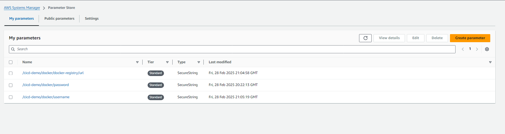
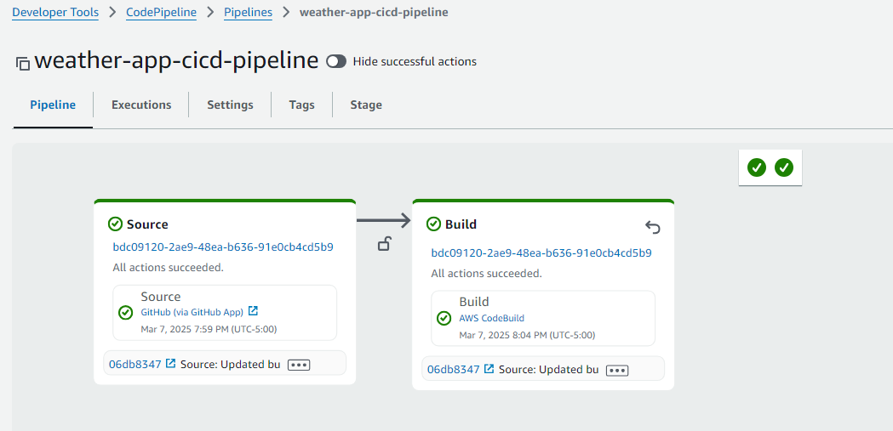

# Building a CI/CD Pipeline for a Weather App - Simple Guide

This guide will walk you through creating an automated deployment pipeline for a weather application using AWS services. Don't worry if you're new to this - I'll explain each step clearly!

## What We're Building

A CI/CD (Continuous Integration/Continuous Deployment) pipeline automatically builds and deploys your application whenever you make changes to your code. Think of it as a robot that handles all the technical steps for you!

I'm using a simple Weather App for this example. You can fork [the repository](https://github.com/ShivangDholaria/Weather-App) if you want to follow along.

## Step 1: Set Up Your Secrets

First, we need to store sensitive information like passwords securely:

1. Open AWS Systems Manager and select "Parameter Store"
2. Click "Create parameter"
3. Create the following secure parameters:
   - DOCKER_USERNAME (your Docker Hub username)
   - DOCKER_PASSWORD (your Docker Hub password) 
   - DOCKER_REGISTRY_URL (set this to "docker.io")

## Step 2: Create Your Pipeline

Now let's set up the pipeline that will automate everything:

1. Log into your AWS account and open AWS CodePipeline
2. Click "Create pipeline" and select "Build custom pipeline"
3. Give your pipeline a name (like "weather-app-pipeline")
4. For source provider, select "GitHub" and connect your GitHub account
5. Find and select your repository and set branch to "main"

## Step 3: Set Up the Build Process

Before continuing with the pipeline, we need to create a build project:

1. Open AWS CodeBuild in a new tab
2. Click "Create build project"
3. Enter a name for your project
4. Select GitHub as the source and connect to your repository
5. For environment, keep the defaults but select "Ubuntu" as the operating system
6. Under buildspec, select "Use a buildspec file" (this file is already in the repository)
7. Click "Create build project"

Next, we need to give this build project special permissions:

1. Go to AWS IAM and find the role created by CodeBuild
2. Add the "AmazonSSMReadOnlyAccess" policy to this role
3. Go back to your build project and edit the environment settings
4. Check the box that says "Enable this flag if you want to build Docker images..."

## Step 4: Set Up the Deployment

Now we need to create the deployment configuration:

1. Open AWS CodeDeploy in a new tab
2. Click "Create application"
3. Give it a name and select "EC2/On-premises" as the platform
4. Add a tag with Key "env" and Value "prod"
5. Click "Create application"

We need to create two special roles for this to work:

1. Go to AWS IAM and create a role for EC2:
   - Select EC2 as the trusted entity
   - Add the "AmazonEC2RoleforAWSCodeDeploy" permission
   - Name it something like "EC2-CodeDeploy-Role"

2. Create another role for CodeDeploy:
   - Select CodeDeploy as the trusted entity
   - Keep the default permissions
   - Name it something like "CodeDeploy-Service-Role"

3. Go back to CodeDeploy and create a deployment group:
   - Enter a name for your group
   - Select the CodeDeploy role you just created
   - Under environment, check "Amazon EC2 Instances"
   - Add the tag "env:prod"
   - Uncheck "Enable load balancer"
   - Click "Create deployment group"

4. Return to your pipeline and add this deployment configuration to the deploy stage

## Step 5: Create Your Server

Now we'll create the server where your app will run:

1. Create a t2.micro EC2 instance with Ubuntu
2. Add the tag "env:prod" to this instance
3. Assign the EC2 role you created earlier to this instance
4. Connect to your instance and install:
   - Docker (to run your application)
   - CodeDeploy Agent (to receive deployments)
   
   For the CodeDeploy Agent, follow [these installation instructions](https://docs.aws.amazon.com/codedeploy/latest/userguide/codedeploy-agent-operations-install-ubuntu.html)

## Step 6: Run Your Pipeline

Your pipeline is now ready!

1. Make a small change to your repository (edit the README file)
2. Commit and push the change
3. Watch as your pipeline automatically builds and deploys your application

## What Just Happened?

When you pushed your code change:

1. AWS detected the change in your GitHub repository
2. CodeBuild created a Docker image of your application
3. The image was pushed to Docker Hub
4. CodeDeploy sent the deployment instructions to your EC2 server
5. Your server pulled the Docker image and started running your application

Congratulations! You've built a complete CI/CD pipeline that automatically deploys your application whenever you make changes to your code.